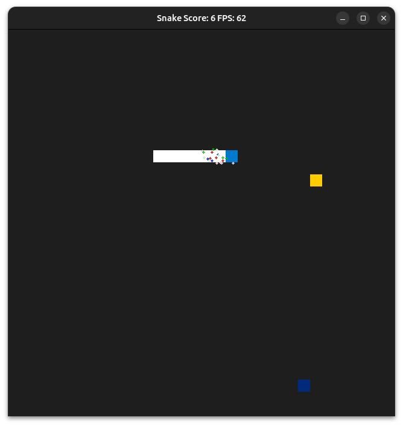
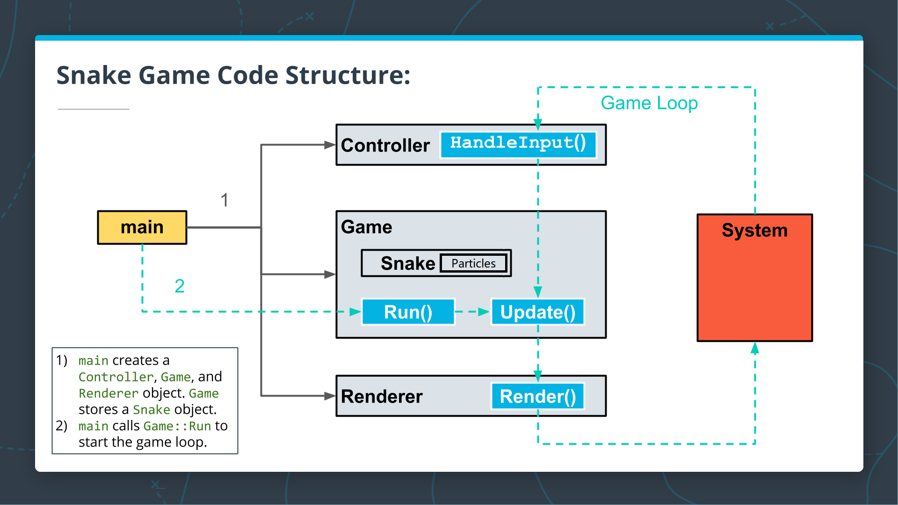

# CPPND: Capstone Snake Game Project

This is my own version of Snake Game based on demo project from [Udacity C++ Nanodegree Program](https://www.udacity.com/course/c-plus-plus-nanodegree--nd213). The code for this repo was inspired by [this](https://codereview.stackexchange.com/questions/212296/snake-game-in-c-with-sdl) excellent StackOverflow post and set of responses.

## Dependencies for Running Locally
* cmake >= 3.7
  * All OSes: [click here for installation instructions](https://cmake.org/install/)
* make >= 4.1 (Linux, Mac), 3.81 (Windows)
  * Linux: make is installed by default on most Linux distros
  * Mac: [install Xcode command line tools to get make](https://developer.apple.com/xcode/features/)
  * Windows: [Click here for installation instructions](http://gnuwin32.sourceforge.net/packages/make.htm)
* SDL2 >= 2.0
  * All installation instructions can be found [here](https://wiki.libsdl.org/Installation)
  >Note that for Linux, an `apt` or `apt-get` installation is preferred to building from source. 
* gcc/g++ >= 5.4
  * Linux: gcc / g++ is installed by default on most Linux distros
  * Mac: same deal as make - [install Xcode command line tools](https://developer.apple.com/xcode/features/)
  * Windows: recommend using [MinGW](http://www.mingw.org/)

## Basic Build Instructions

1. Clone this repo.
2. Make a build directory in the top level directory: `mkdir build && cd build`
3. Compile: `cmake .. && make`
4. Run it: `./SnakeGame`.

## New Features In This Project

1. Snake's head is decorated with particles.
2. There are two snakes on one panel, although the second one is more like a ghost who is always spinning in the window.

## Class Structure And Expected Behaviour of the program.

### Class Structure

The Snake gmae code consists of six main classes: <code>Game,Snake, AutoSnake, Particle, Controller</code>, and <code>Renderer</code>.The image above shows how the code functions.

1. To begin, <code>main</code> creates a <code>Controller</code>, a <code>Game</code>, and a <code>Renderer</code> object. <code>Game</code> stores a <code>Snake</code> object and an <code>AutoSnake</code> object as part of the state. Then <code>Snake</code> stores an array of <code>Particle</code> objects to decorate it's head. On contrary, <code>AutoSnake</code> is not decorated with <code>Particle</code>. 
2. <code>main</code> calls <code>Game::Run</code> to start the game loop.
3. <code>Snake</code> can be controled manually, while <code>AutoSnake</code> tends to move automatically.

### Expected Behavior

1. There are two snakes on one panel. <code>Snake</code> can be controled by user, and <code>AutoSnake</code> behaves more like ghost who keeps circle around.
2. <code>AutoSnake</code> does not eat food, and its body never grows either.
3. <code>AutoSnake</code> will not collide with <code>Snake</code>.

## Addressed Points

### Loops, Functions, I/O

1. Requirement: The project code is clearly organized into functions.

The project follows procedure of Input, Update, and Render. 
(Refer to <code>game.cpp</code>, line 26-28)

2. Requirement: The project reads data from an external file.

The project reads images from bmp files to generate particles.
(Refer to <code>render.cpp</code>, line 38-69)

3. Requirement: The project accepts input from a user.

(Refer to <code>controller.cpp</code>, line 10-35)

### Object Oriented Programming

1. Requirement: Code is organized into classes

There are a few already organized classes in the demo. Some of the newly organized classes comprise <code>particle</code>, <code>ltexture</code> and etc.
(Refer to <code>particle.h</code> and <code>ltexture.h</code>. all lines)

2. Requirement: Member data that is subject to an invariant is hidden from the user, State is accessed via member functions.

In <code>ltexture</code>, member variable `mWidth` and `mHeight` are invariant, and user can only read them via member functions. (Refer to <code>ltexture.h</code>, lines 34-45)

3. Requirement: Inheritance hierarchies are logical.

<code>AutoSnake</code> derives from <code>Snake</code>, and it increases func of `Redirect` and `TurnLeft` to enable the snake to move automatically. (Refer to <code>AutoSnake.h</code>, all lines)

### Memory Management

1. Requirement: At least two variables are defined as references.

Both `sdl_window` and `sdl_renderer` are defined as references.
(Refer to <code>renderer.h</code>, line 29-30)

2. Requirement: The project uses at least one smart pointer.

`unique_ptr` is used in this project.(Refer to <code>game.h</code>, line 24-25, and also <code>snake.h</code>, line 46)

## CC Attribution-ShareAlike 4.0 International

Shield: [![CC BY-SA 4.0][cc-by-sa-shield]][cc-by-sa]

This work is licensed under a
[Creative Commons Attribution-ShareAlike 4.0 International License][cc-by-sa].

[![CC BY-SA 4.0][cc-by-sa-image]][cc-by-sa]

[cc-by-sa]: http://creativecommons.org/licenses/by-sa/4.0/
[cc-by-sa-image]: https://licensebuttons.net/l/by-sa/4.0/88x31.png
[cc-by-sa-shield]: https://img.shields.io/badge/License-CC%20BY--SA%204.0-lightgrey.svg
