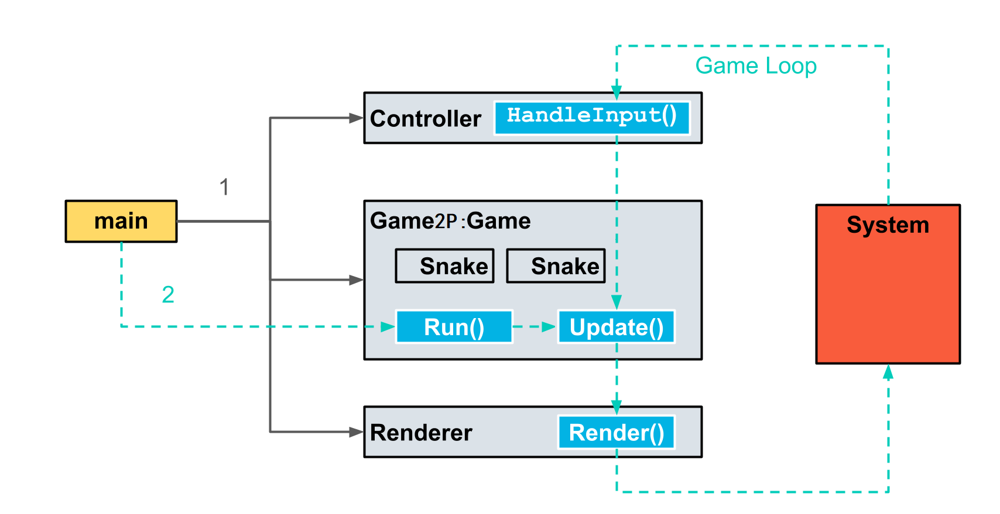

# CPPND: Capstone Snake Game Project

This is my own version of Snake Game based on demo project from [Udacity C++ Nanodegree Program](https://www.udacity.com/course/c-plus-plus-nanodegree--nd213). The code for this repo was inspired by [this](https://codereview.stackexchange.com/questions/212296/snake-game-in-c-with-sdl) excellent StackOverflow post and set of responses.

## Dependencies for Running Locally
* cmake >= 3.7
  * All OSes: [click here for installation instructions](https://cmake.org/install/)
* make >= 4.1 (Linux, Mac), 3.81 (Windows)
  * Linux: make is installed by default on most Linux distros
  * Mac: [install Xcode command line tools to get make](https://developer.apple.com/xcode/features/)
  * Windows: [Click here for installation instructions](http://gnuwin32.sourceforge.net/packages/make.htm)
* SDL2 >= 2.0
  * All installation instructions can be found [here](https://wiki.libsdl.org/Installation)
  >Note that for Linux, an `apt` or `apt-get` installation is preferred to building from source. 
* gcc/g++ >= 5.4
  * Linux: gcc / g++ is installed by default on most Linux distros
  * Mac: same deal as make - [install Xcode command line tools](https://developer.apple.com/xcode/features/)
  * Windows: recommend using [MinGW](http://www.mingw.org/)

## Basic Build Instructions

1. Clone this repo.
2. Make sure necessary packages are installed.
3. try: `sudo apt-get install libsdl2-dev`
4. try: `sudo apt-get install libsdl2-image-dev`
5. try: `sudo apt-get install libsdl2-ttf-dev`
6. Make a build directory in the top level directory: `mkdir build && cd build`
7. Compile: `cmake .. && make`
8. Run it: `./SnakeGame`.

## New Features In This Project

1. Menu: Implemented an easy menu to provide better UI.

 

2. 1 Player Mode (1P)

* Snake's head is decorated with particles. 

 

* Poisonous food type introduced. When it is consumed, the snake's direction will be reversed. (Refer to `game_adv_food.cpp`, line 98-100)

* Poisonous food is in green.  The probability of food being poisonous is 20%. (Refer to `food.cpp`, line 12-17)

* Every food grid will be refreshed after a few seconds, so player do not have to eat poisonous food. (Refer to `food.cpp`, line 8-10)

* Player has 3 lives per game. (Refer to `main.cpp`, line 32-33)

* Introduce Producer and Consumer mechanism to create and delete food. In specific, there is one main thread and 2 additional threads being responsible for this. (Refer to `multithreads.cpp`, all lines)

After produced by thread 1, the food could be consumed in two ways: 1) "eaten" in main thread, 2) "thrown away" in thread 2 after a few seconds.

2. Multiplayer Mode (PvP)

* A second snake is incorporated allowing for 2 player competitions.

Player 1 is in blue, and Player 2 is in red.

* Player 1's keyboard configeration is: up, down, left, and right, while Player 2's is: w, s, a, and d.

* No particles displayed in PvP mode.

* Just as one snake can kill itself, when 2 snakes cross, the game will also be stopped.

* The longer snake wins the game.

* There is only normal food in this mode, and food will no longer be replaced as in 1P mode.

3. AI Mode (PvC)

* Player can also play against computer, and the UI is mostly like PvP mode.

* The algorithm is implemented as follows: 1) go to target x, 2) then turn left, 3) go to target y.

* The AI snake may occationally kill itself by turning left, but it is still competitive in general.

* The rest rules are the same as rules 2 to 5 in PvP mode.

## Class Structure And Expected Behaviour of the program.

### Class Structure

The Snake gmae code consists of 4 main classes: <code>Game,Snake, Controller</code>, and <code>Renderer</code>.The image above shows how the code functions.

1. To begin, <code>main</code> creates a <code>Controller</code>, a <code>Game</code>, and a <code>Renderer</code> object. <code>Game</code> stores a <code>Snake</code> object. 
2. <code>main</code> calls <code>Game::Run</code> to start the game loop.
3. 1 Player Mode: a few classes and functions are introduced for new features.
* `Game` is inherited by `GameAdvFood` in order to support different food types. So, `GameAdvFood` stores `Food` object.
* `Producer` and `Consumer` are responsible for generating food and replacing old food.
* `Particle` is stored in snake, and it is used for decoration.
* Final code structure looks like this:

4. PvP Mode: 

* `Game` is inherited by `Game2P` in order to store two `Snake` objects.
* Function `Update` is overrided in Class `Game2P` with new logic.
* Function `HandleInput` is overloaded in Class `Controler`.
* Function `Render` is also overloaded in Class `Renderer`.

5. PvC Mode: 

* `Game` is inherited by `GamePvC` in order to store `Snake` and `AutoSnake`.
* Function `Update` is overrided in Class `GamePvC` with new logic.

## Addressed Points

### Loops, Functions, I/O

1. Requirement: The project code is clearly organized into functions.

The project's main operations are organized into 3 functions:HandleInput, Update, and Render. 
(Refer to <code>game_adv_food.cpp</code> line 22-25, <code>game2p.cpp</code> line 26-29, <code>gamepvc.cpp</code> line 23-27)

2. Requirement: The project reads data from an external file.

The project reads images from bmp files to generate particles.
(Refer to <code>render.cpp</code>, line 49-75)

3. Requirement: The project accepts input from a user.

(Refer to <code>controller.cpp</code>, line 16-35)

### Object Oriented Programming

1. Requirement: Code is organized into classes

The project code is organized into classes with class attributes to hold the data, and class methods to perform tasks. 
(Refer to <code>autosnake.h</code>, <code>food.h</code>, and <code>particle.h</code>. all lines)

2. Requirement: class data members are explictly specified as public, protected, or private.
(Refer to <code>game.h</code> line 22-36, <code>game_adv_food.h</code> line 34-39)

3. Requirement: Member data that is subject to an invariant is hidden from the user, State is accessed via member functions.

In Class <code>GameAdvFood</code>, member data `Food` is hidden from the user, and user can only access this invariant via public member functions like `MakeFood()` or `CleanFood()`. (Refer to <code>game_adv_food.h</code>, lines 27-30)

4. Requirement: Inheritance hierarchies are logical.

Class <code>Game2P</code> derives from <code>Game</code>, and it implement pure virtual function `Update` in Class `Game`.  Besides, Class `Game2P` stores `Snake` object using composition. (Refer to <code>game.h</code> line 36, <code>game2p.h</code> line 26)

5. Requirement: One function is overloaded with different signatures for the same function name.

(Refer to <code>renderer.h</code> line 36-38, <code>controller.h</code> line 10-11)

### Memory Management

1. Requirement: At least two functions use pass-by-reference in the project code.

Function `Render` and `RenderMainMenu` use pass-by-reference.
(Refer to <code>renderer.h</code>, line 38-39)

2. Requirement: The project uses at least one smart pointer.

`unique_ptr` is used in this project.(Refer to <code>game.h</code>, line 24, and also <code>snake.h</code>, line 51)

### Concurrency

1. Requirement: The project uses multiple threads in the execution.

Two additional threads are launched in Class `GameAdvFood`.
(Refer to <code>game_adv_food.h</code>, line 6-7)

2. Requirement: A mutex or lock is used to protect data.

I used SDL2 mutex to protect data in Producer and Consumer. Many thanks to [Lazy Foo's Production]( https://lazyfoo.net/tutorials/SDL/49_mutexes_and_conditions/index.php). (Refer to <code>multithreads.h</code>, line 53, 69)

3. Requirement: A condition variable is used to synchronize thread execution.

I used SDL2 condition variable to synchronize thread execution. Many thanks to [Lazy Foo's Production]( https://lazyfoo.net/tutorials/SDL/49_mutexes_and_conditions/index.php). (Refer to <code>multithreads.h</code>, line 60, 87)

## CC Attribution-ShareAlike 4.0 International

Shield: [![CC BY-SA 4.0][cc-by-sa-shield]][cc-by-sa]

This work is licensed under a
[Creative Commons Attribution-ShareAlike 4.0 International License][cc-by-sa].

[![CC BY-SA 4.0][cc-by-sa-image]][cc-by-sa]

[cc-by-sa]: http://creativecommons.org/licenses/by-sa/4.0/
[cc-by-sa-image]: https://licensebuttons.net/l/by-sa/4.0/88x31.png
[cc-by-sa-shield]: https://img.shields.io/badge/License-CC%20BY--SA%204.0-lightgrey.svg
